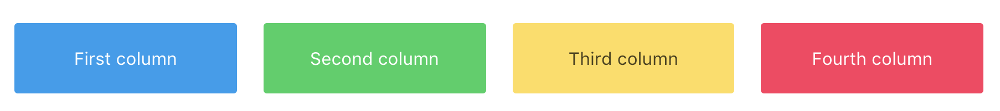
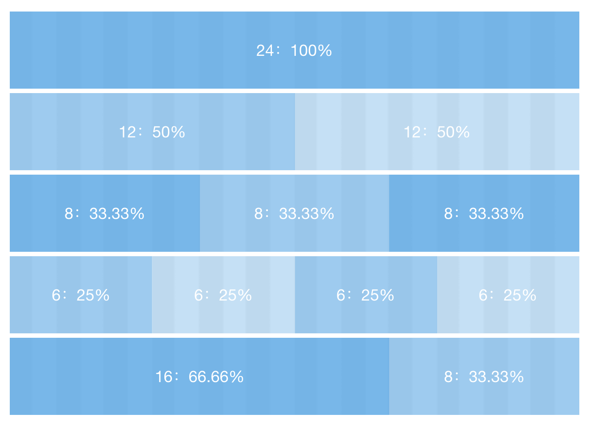
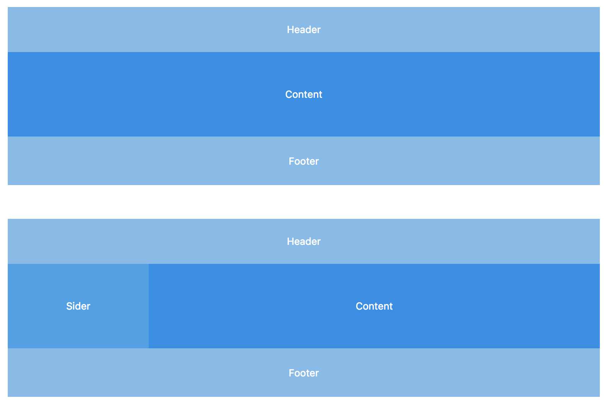

# 布局

页面整体布局是一个产品最外层的框架结构，往往会包含导航、页脚、侧边栏、通知栏以及内容等。在页面之中，也有很多区块的布局结构。

## 使用 Bulma 布局

```html
<div class="columns">
  <div class="column">First column</div>
  <div class="column">Second column</div>
  <div class="column">Third column</div>
  <div class="column">Fourth column</div>
</div>
```


```html
<div class="columns">
  <div class="column is-half">is-half</div>
  <div class="column">Auto</div>
  <div class="column">Auto</div>
</div>
```

更多 Bulma 布局能力，请移步 [Bulma官方文档](https://bulma.io/documentation/columns/basics/)

## 使用 iView 的 Grid 栅格

```html
<Row>
  <Col span="24">col-24：100%</Col>
</Row>
<Row>
  <Col span="12">col-12：50%</Col>
  <Col span="12">col-12：50%</Col>
</Row>
<Row>
  <Col span="8">col-8：33.33%</Col>
  <Col span="8">col-8：33.33%</Col>
  <Col span="8">col-8：33.33%</Col>
</Row>
<Row>
  <Col span="6">col-6：25%</Col>
  <Col span="6">col-6：25%</Col>
  <Col span="6">col-6：25%</Col>
  <Col span="6">col-6：25%</Col>
</Row>
<Row>
  <Col span="16">col-16：66.66%</Col>
  <Col span="8">col-8：33.33%</Col>
</Row>
```

## 使用内置的布局组件

Element 的[布局容器](http://element-cn.eleme.io/#/zh-CN/component/container)组件实现地非常优雅、完善，为了把控项目依赖的基础组件库数量，我们直接把 Element 布局组件移植到了 T-Design 中，在此向 Element 团队表示感谢！


```javascript
import { container, header, aside, main, footer } from 't-design';
```
```html
<icontainer>
  <iheader>Header</iheader>
  <imain>Content</imain>
  <ifooter>Footer</ifooter>
</icontainer>
<icontainer>
  <iheader>Header</iheader>
  <icontainer>
    <iaside>Sider</iaside>
    <imain>Content</imain>
  </icontainer>
  <ifooter>Footer</ifooter>
</icontainer>
```
